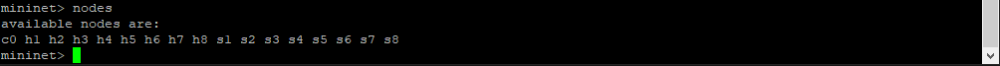

# C115-L1_Mininet_Final
Repository for my final homework for Mininet tool for C115 subject.

## Contents

- [Activity 1](#activity-1)
  - [1- Login in to Mininet Virtual Machine through PuTTy](#1--login-in-to-mininet-virtual-machine-through-putty)
  - [2- Creating the Topology](#2--creating-the-topology)
  - [3- Inspecting Topology Information](#3--inspecting-topology-information)
    - [Topology Nodes](#topology-nodes)
    - [Topology Net](#topology-net)
    - [Logical Ports Addresses](#logical-ports-addresses)
    - [Hosts Data](#hosts-data)
  - [4- Ping Test for all Nodes](#4--ping-test-for-all-nodes)
  - [5- Server-Client Test](#5--server-client-test)
    - [Setting Host1 as Server and Host2 as Client](#setting-host1-as-server-and-host2-as-client)
    - [Host-Client 1Mbps](#host-client-1mbps)
    - [Host-Client 5Mbps](#host-client-5mbps)
    - [Host-Client 10Mbps](#host-client-10mbps)
    - [Host-Client 15Mbps](#host-client-15mbps)
    - [Host-Client 20Mbps](#host-client-20mbps)
    - [Host-Client 25Mbps](#host-client-25mbps)
- [Activity 2](#activity-2)

---

## Activity 1

### Proposal

The following text describes the proposal for this activity:

```text
Consider a linear topology with eight hosts.
  - Use Mininet's standard command line to create the topology with standardized MAC addresses, bandwidth of 30 Mbps, and Mininet's default controller.
  - Inspect the interfaces, MAC, IP, and port addresses via command-line tools.
  - Perform ping tests between all nodes, capturing packets with `tcpdump`.
  - Host 1 on port 5555 will be a TCP server, and Host 2 a client. Run iperf tests for bandwidths of 1.5, 10, 15, 20, and 25 Mbps, with reports generated every second for 15 seconds.
```

### 1- Login in to Mininet Virtual Machine through PuTTy


---

### 2- Creating the Topology


---

### 3- Inspecting Topology Information

#### Topology Nodes



---

#### Topology Net


---

#### Logical Ports Addresses


---

#### Hosts Data


---

### 4- Ping Test for all Nodes


---

### 5- Server-Client Test

#### Setting Host1 as Server and Host2 as Client


---

#### Host-Client 1Mbps


---

#### Host-Client 5Mbps


---

#### Host-Client 10Mbps


---

#### Host-Client 15Mbps


---

#### Host-Client 20Mbps


---


#### Host-Client 25Mbps


---

## Activity 2

*Placeholder for upcoming activity details.*

---

## About

This repository is part of my learning journey using Mininet for network simulation tasks in the C115 course.
